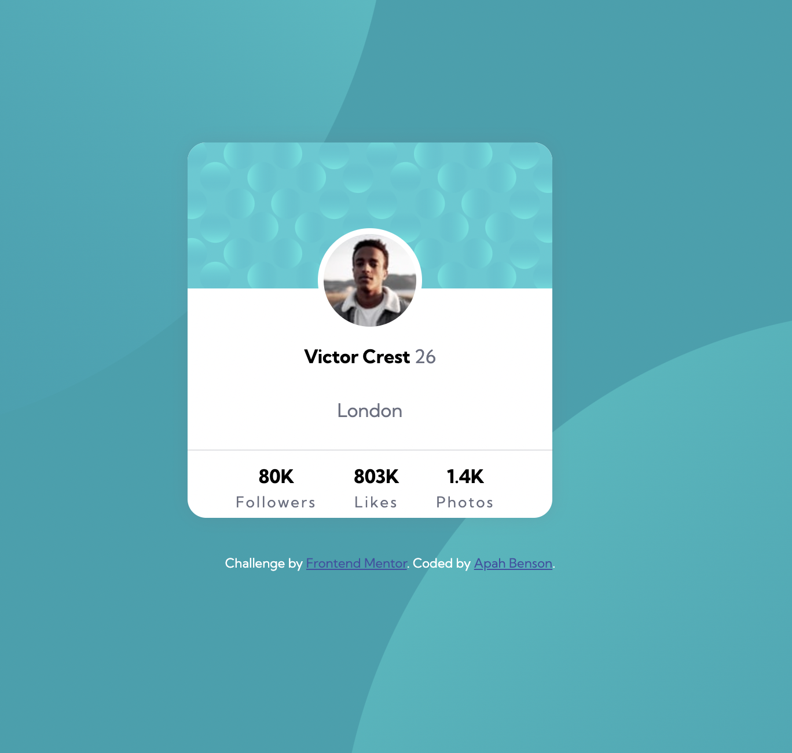

# Frontend Mentor - Profile card component solution

This is a solution to the [Profile card component challenge on Frontend Mentor](https://www.frontendmentor.io/challenges/profile-card-component-cfArpWshJ). Frontend Mentor challenges help you improve your coding skills by building realistic projects.

## Table of contents

- [Overview](#overview)
  - [The challenge](#the-challenge)
  - [Screenshot](#screenshot)
  - [Links](#links)
- [My process](#my-process)
  - [Built with](#built-with)
  - [What I learned](#what-i-learned)
  - [Continued development](#continued-development)

## Overview

### The challenge

- Build out the project to the designs provided

### Screenshot



### Links

- Solution URL: [Add solution URL here](https://github.com/apah-dev/profile-card-component-main.git)
- Live Site URL: [Add live site URL here](https://apah-dev.github.io/profile-card-component-main/)

## My process

### Built with

- Semantic HTML5 markup
- CSS custom properties
- Flexbox
- CSS Grid
- Mobile-first workflow

### What I learned

Learnt a new way to centeralize everything within the body element

Learnt to use more than one background image for the body element along with a bg-color

````

```css
  background-image: url(images/bg-pattern-top.svg),
  url(images/bg-pattern-bottom.svg);
  background-repeat: no-repeat;
  background-position: right 50vw bottom 42vh, left 47vw top 46vh;


display: grid;
place-content: center;
min-height: 100vh;
````

### Continued development

I'll learn how to use the vw and vh properties to position images in the background

## Author

- Frontend Mentor - [@apah-dev](https://www.frontendmentor.io/profile/apah-dev)
- Twitter - [@benson_apah](https://www.twitter.com/benson_apah)

## Acknowledgments

Huge thanks to creators at front end mentor for their advice
